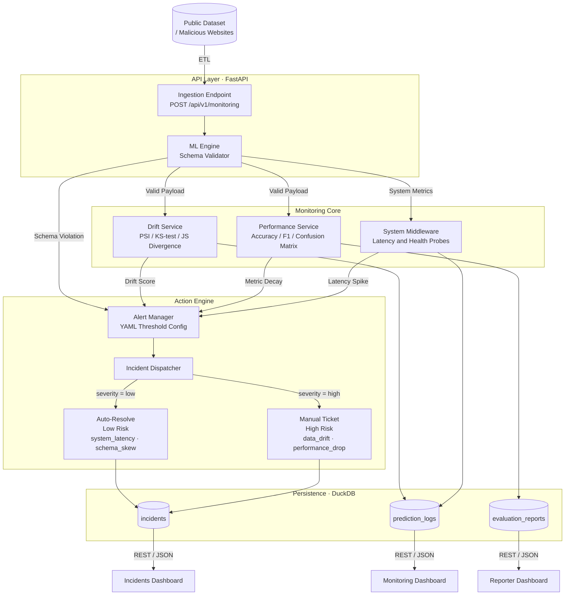

# VigilantMLOps

**A production-grade platform for monitoring ML incidents, drift, and performance.**

VigilantMLOps gives ML teams a real-time observability layer over binary classification models — surfacing data drift, concept drift, and performance decay before they become production incidents. Built around a Network Intrusion / Malicious URL detection use case, but designed to be model-agnostic.

---

## Architecture



### Key API Routes

| Prefix | Purpose |
|---|---|
| `/api/v1/monitoring` | Live drift & telemetry metrics |
| `/api/v1/reporter` | Pre/post-production evaluation reports |
| `/api/v1/incidents` | Incident log (auto-triggered by alerting engine) |
| `/api/v1/telemetry` | System health & latency probes |

---

## Prerequisites

| Requirement | Version |
|---|---|
| Python | 3.12.x |
| Poetry | 1.8+ |
| Docker & Docker Compose | 24+ |
| Node.js | 20+ (for local UI dev) |

---

## Quick Start (Docker Compose)

```bash
# 1. Clone the repo
git clone https://github.com/baraalsedih/vigilant-mlops.git
cd vigilant-mlops

# 2. Copy environment template
cp .env.example .env          # edit values if needed

# 3. Start the full stack
docker compose up --build

# Services:
#   Backend API  →  http://localhost:8000
#   API Docs     →  http://localhost:8000/docs
#   Frontend     →  http://localhost:5173
```

---

## Local Development

Run `make help` to see all available commands.

### Backend

```bash
make dev-backend     # start FastAPI with hot reload
```

### Database

```bash
make db-init         # apply migrations (idempotent)
make db-reset        # drop all tables and re-migrate from scratch
make db-status       # show applied migration history
make seed            # populate DuckDB with evaluation + drift data
```

### Tests

```bash
make test
```

---

## Project Structure

```
vigilant-mlops/
├── apps/
│   ├── backend/          # FastAPI application
│   │   ├── api/v1/       # Route handlers (monitoring, reporter, incidents, telemetry)
│   │   ├── services/     # Business logic (drift_detector, performance_service, alerting_engine …)
│   │   ├── core/         # DB manager, migrations, procedures config
│   │   └── main.py
│   └── ui/               # React + Vite + Tailwind frontend
├── artifacts/            # Trained model artifacts
├── scripts/              # Seed & utility scripts
└── docker-compose.yml
```

---

## Incident Procedures

Automated remediation actions are defined in [apps/backend/core/procedures.yaml](apps/backend/core/procedures.yaml):

| Incident Type | Risk | Auto-Trigger |
|---|---|---|
| `system_latency` | Low | Yes — refetch DB |
| `schema_skew` | Low | Yes — refetch schema |
| `data_drift` | High | No — ticket only |
| `performance_drop` | High | No — ticket only |

---

## Contact

**Bara Al-Sedih** — [github.com/baraalsedih](https://github.com/baraalsedih) · baraalsedih@gmail.com
